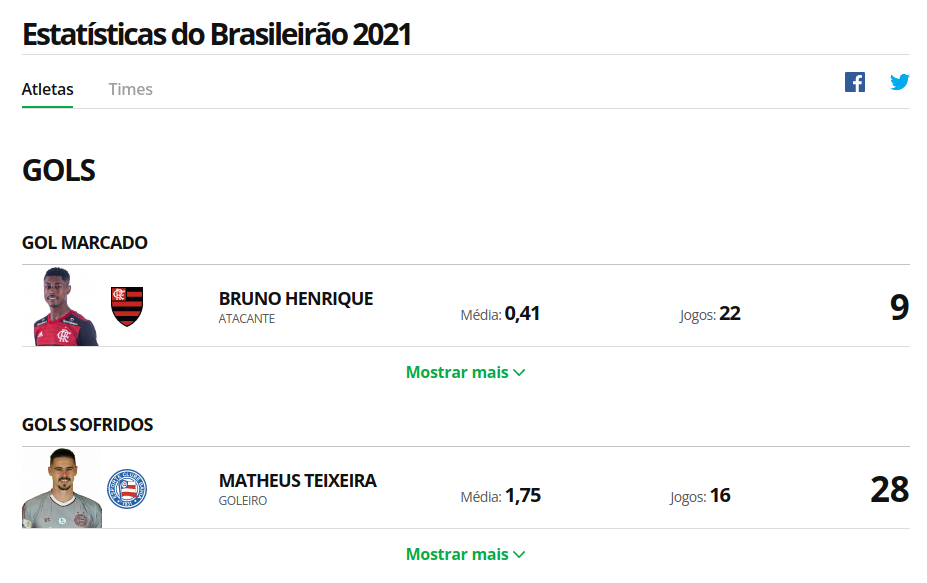
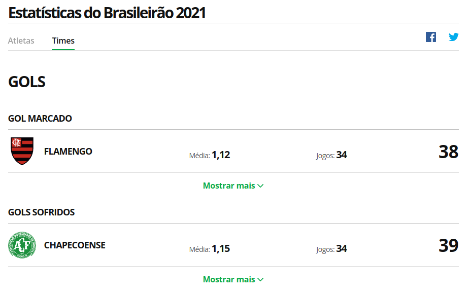

# ETL-Brasileirao-2021-Project

Application for build ETL with Brasileirao 2021 data

The purpose this application is build basic ETL program with data from globo esporte website. The data consists in 
information of Brasileirão 2021. The first step was get the data by scrapy for to construct csv files. 

- [x] Extract Process
  - [x] Web Scrapping with data globo esporte website
- [ ] Transform
- [ ] Load
  - [ ] Load data in relational database
- [ ] Create dashboard and charts

This data can be founded in : 

- https://interativos.globoesporte.globo.com/estatisticas/atletas/
- https://interativos.globoesporte.globo.com/estatisticas/times/

 

